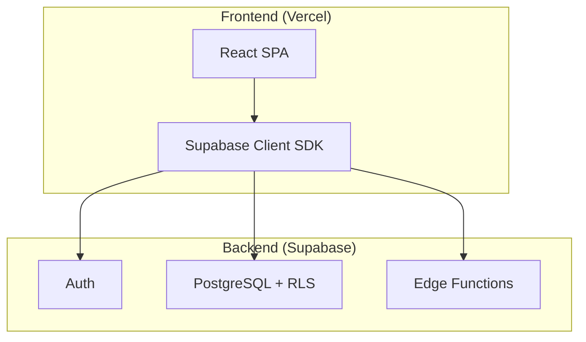

# Ruma Dragon Boat - Architecture Best Practices

This document establishes architectural best practices and guidelines for the Ruma Dragon Boat web application to ensure maintainability, scalability, and security.

---

## 1. Architecture Overview

| Aspect       | Value                                             |
| :----------- | :------------------------------------------------ |
| **Pattern**  | Client-Side Rendering (CSR) SPA                   |
| **Stack**    | React 19 (Vite) + Supabase (BaaS)                 |
| **Hosting**  | Vercel                                            |
| **Styling**  | Tailwind CSS                                      |

**Core Principle**: "Backend as a Service" - The frontend interacts directly with Supabase for database operations and authentication, relying on **Row Level Security (RLS)** as the primary data protection mechanism.



---

## 2. Frontend Best Practices (React + Vite)

### 2.1 Component Organization

> [!TIP]
> Keep components small; follow the Single Responsibility Principle.

| Directory          | Purpose                                        |
| :----------------- | :--------------------------------------------- |
| `src/components/`  | Shared, reusable UI elements (Buttons, Inputs) |
| `src/pages/`       | Route-level page components                    |
| `src/contexts/`    | React Context providers (Auth, Language)       |
| `src/api/`         | Centralized API/data-fetching logic            |
| `src/lib/`         | External service clients (e.g., Supabase init) |
| `src/utils/`       | Pure utility functions                         |

### 2.2 State Management

-   **Global State**: Use **React Context** for app-wide concerns (Auth, Theme, Language).
-   **Local State**: Use `useState` / `useReducer` for component-specific logic.
-   **Server State**: Encapsulate data fetching in `src/api/`. Consider `TanStack Query` for caching if complexity grows.

### 2.3 Styling with Tailwind CSS

-   Use utility classes for layout and spacing.
-   Define design tokens (colors, fonts) in `tailwind.config.js`.
-   **Avoid arbitrary values** (e.g., `w-[123px]`). Use theme tokens instead.

### 2.4 Performance

-   **Code Splitting**: Lazy load routes using `React.lazy()` and `<Suspense>`.
-   **Assets**: Optimize images (prefer WebP), use SVG icons from `lucide-react`.

---

## 3. Backend Best Practices (Supabase)

### 3.1 Database Schema

-   Use strict PostgreSQL types.
-   Use **Foreign Keys** to maintain referential integrity.
-   Consider adding indexes on frequently queried columns.

### 3.2 Data Access

> [!IMPORTANT]
> All Supabase queries MUST live in `src/api/`. Do NOT scatter `supabase.from('...').select()` calls inside UI components.

This centralized approach:
1.  Improves readability.
2.  Simplifies refactoring and testing.
3.  Makes it easier to find and audit data access patterns.

### 3.3 Edge Functions

Use Supabase Edge Functions for:
-   Sensitive third-party API calls (API keys must not be exposed client-side).
-   Complex server-side data aggregation.

*Since this project has no payment gateway, most logic can remain client-side, protected by RLS.*

---

## 4. Security Guidelines (InfoSec)

> [!CAUTION]
> The frontend can be tampered with. The database RLS is the **final line of defense**.

### 4.1 Authentication

-   Use **Supabase Auth** exclusively. Never roll your own authentication.
-   Enforce strong password policies if configurable in Supabase Auth settings.

### 4.2 Authorization (Critical)

| Rule                  | Description                                                                 |
| :-------------------- | :-------------------------------------------------------------------------- |
| **RLS Enabled**       | Row Level Security **MUST** be enabled on ALL database tables.             |
| **Explicit Policies** | Define policies for `SELECT`, `INSERT`, `UPDATE`, `DELETE`.                |
| **Server-Side Check** | **Never** verify permissions only in the UI. UI can be bypassed by anyone. |

**Example Policy Logic**:
```
-- Policy: Public can view events
create policy "Public can view events" on events
for select using (true);

-- Policy: Only admins can modify events
create policy "Admins can modify events" on events
for all using (is_admin(auth.uid()));
```

### 4.3 Data Handling

-   React handles XSS prevention for content rendered with JSX. Continue this practice.
-   Do not hide admin features *only* with UI logic; always enforce via RLS.

### 4.4 Secrets Management

| Secret                       | Storage                           | Notes                                                |
| :--------------------------- | :-------------------------------- | :--------------------------------------------------- |
| `VITE_SUPABASE_URL`          | `.env`                            | Safe to expose (public URL).                         |
| `VITE_SUPABASE_ANON_KEY`     | `.env`                            | Public by design; RLS protects data.                 |
| `SUPABASE_SERVICE_ROLE_KEY`  | **Server-side only (Functions)** | **NEVER** use in the frontend. Full DB bypass power. |

> [!WARNING]
> **NEVER** commit `.env` to Git. Ensure it's in `.gitignore`.

---

## 5. Code Quality & Workflow

### 5.1 Linting & Formatting

-   Run `npm run lint` before committing. Fix all warnings.
-   Use consistent code style (Prettier recommended).

### 5.2 Git Practices

-   Write meaningful, atomic commit messages.
-   Use **feature branches** for new work; merge via Pull Requests.

---

*Last Updated: 2026-01-11*
