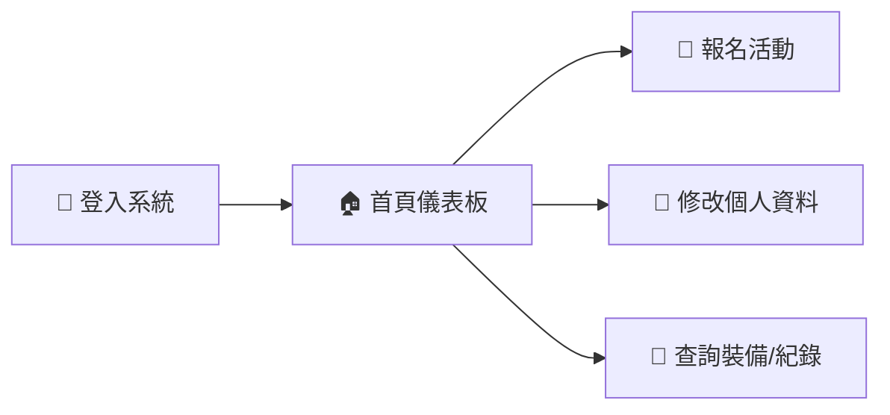
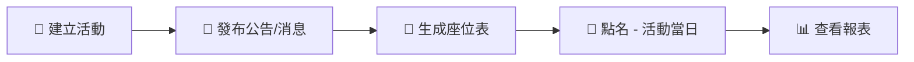
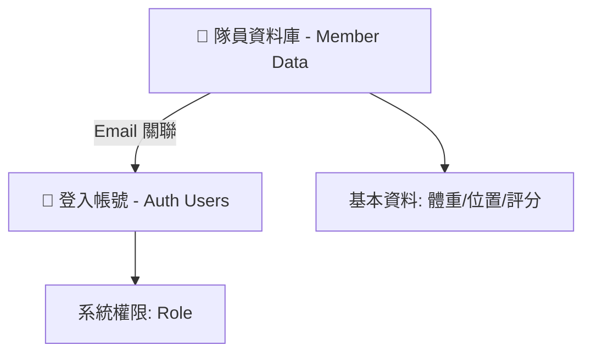

# 🐉 RUMA 平台操作懶人包 (完整版)

本懶人包涵蓋三種使用者角色的精簡操作指南：**隊員**、**幹部**、**管理員**。

---

# 👤 第一部分：隊員 (Member)

## 🚀 30秒快速上手流程

---

## 1️⃣ 登入 (Login)
| 項目 | 說明 |
| :--- | :--- |
| **網址** | RUMA 平台首頁 |
| **帳號** | 您的 **Email** |
| **預設密碼** | `000000` |

> ⚠️ **首次登入後，請務必至「個人資料」修改密碼！**

---

## 2️⃣ 報名練習 (Register)
**路徑**: 導覽列 > **活動報名**

| 步驟 | 說明 |
| :--- | :--- |
| **1. 篩選** | 選擇類別 (船練 / 比賽 / Team Building) |
| **2. 勾選** | 找到想參加的場次，勾選起來 |
| **3. 送出** | 點擊 **「確定報名」**，完成！ |

*   **取消報名**: 點擊旁邊的紅色垃圾桶 🗑️ 即可。
*   **查看槳位**: 船練頁面下方會顯示自動分派的座位表。

---

## 3️⃣ 其他功能速查

| 功能 | 說明 |
| :--- | :--- |
| 🏠 **首頁儀表板** | 查看 M點、出席率、排名、成就徽章 |
| 👤 **個人資料** | 換頭像、改暱稱、改密碼 |
| 🛶 **裝備查詢** | 查庫存、確認借用紀錄 |

---

# 📋 第二部分：幹部 (Management)

## 📋 幹部日常任務流程

---

## 1️⃣ 活動管理 (Activities)
**路徑**: 幹部專區 > **活動管理**

*   **建立**: 填寫 名稱、日期、時間、地點 ➡️ **「建立活動」**。
*   **管理**: 可刪除 🗑️ 活動或清除過舊資料。

> 💡 建立後隊員即可馬上報名。

## 2️⃣ 資訊發布 (News & Announcements)

| 功能 | **建立公告** | **最新消息** |
| :--- | :--- | :--- |
| **用途** | 隊內行政布達 | **官網對外展示** |
| **內容** | 純文字、置頂 | 雙語、圖片、影片、排版 |
| **圖片** | 無 | **需用圖床** (如 ImgBB) |

## 3️⃣ 練習日操作 (Operation Day)

### 🛶 槳位生成 (Seating)
1.  系統依 **左右槳 & 體重** 自動平衡分配。
2.  **手動微調**: 點擊兩個座位可直接 **交換 (Swap)**。

### 📝 點名系統 (Roll Call)
1.  選擇日期 ➡️ **「開啟點名」**。
2.  勾選 **實際出席** 的人員。
3.  **「儲存」** ➡️ 系統自動計算 M 點與更新排行榜。

---

## 4️⃣ 查看報表
**路徑**: 幹部專區 > **出席報表**
*   隨時掌握隊員出席頻率與活躍度排行榜。

---

# 🛠️ 第三部分：管理員 (Admin)

## 🛠️ 後台管理核心概念
請區分 **「資料」** 與 **「帳號」** 的不同：

---

## 1️⃣ 隊員資料管理 (Member Data)
**用途**: 建立隊員檔案 (Profile)。
*   **新增**: 輸入 姓名、**Email** (最重要!)、體重、位置。
*   **維護**: 修改技術評分、體重數據。

> ⚠️ **Email 必須正確**，否則隊員無法連結到他的帳號。

## 2️⃣ 使用者帳號管理 (Auth Users)
**用途**: 給予隊員 **「登入系統的鑰匙」**。

| 操作 | 說明 |
| :--- | :--- |
| **建立帳號** | 輸入 Email + 姓名 + Role，預設密碼 `000000` |
| **指派權限** | 在列表直接切換 Role (`member` / `management` / `admin`) |
| **刪除帳號** | 移除登入權限 (不刪除隊員資料) |

## 3️⃣ 裝備管理 (Inventory)
*   **庫存**: 定期盤點，更新「系統數量」。
*   **借用**: 可由後台 **代為登記**。
*   **歸還**: 點擊「刪除」即代表歸還。

---

## ❓ 常見 FAQ
| 問題 | 解法 |
| :--- | :--- |
| 隊員登入後沒名字/頭像？ | 確認 **隊員資料** 和 **帳號管理** 的 Email 完全一致 |
| 怎麼設幹部？ | 到 **使用者帳號管理** 直接改 Role |

---
> 💡 **遇到問題？** 請聯繫隊伍的行政管理員或技術團隊！
